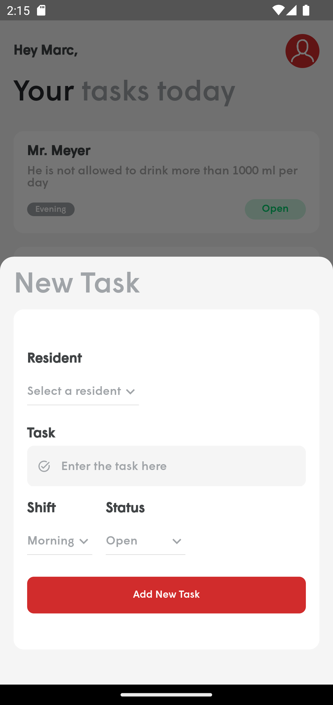

<p align="center"></p>
<h1 align="center">Concept Care</h1></br>

<p align="center">
  <a href="https://github.com/kimathi-phil/nursing_home/actions/workflows/ci.yaml"></a>
  <a href="https://github.com/kimathi-phil/nursing_home/actions/workflows/cd.yaml"></a>
  <a href="https://flutter.dev/docs/development/tools/sdk/releases"></a>
</p>
<p align="center">
<p align="center">A simple task management app for nurses in a nursing home</p>

---
## Screenshots

 |  | 

 | 

---
## Stack

* Technologies used
    * [Flutter](http://flutter.dev/) - A cross-platform UI toolkit for crafting beautiful, natively compiled applications for mobile, web, and desktop from a single codebase.
    * [Dart](http://dart.dev/) - An open-source, general-purpose, object-oriented language for client development on any platform.
    * [Cubit](https://pub.dev/documentation/flutter_cubit/latest/) - A lightweight state management solution and a subset of the bloc package that does not rely on events and instead uses methods to emit new states.
    * [Go Router](https://pub.dev/packages/go_router) - A declarative routing package that uses the Flutter framework's Router API to provide a convenient, url-based API for navigating between different screens.
    * [Firebase Auth](https://pub.dev/packages/firebase_auth) - A package that provides many methods and utilities for enabling you to integrate secure authentication into your Flutter application.
    * [Cloud Firestore](https://pub.dev/packages/cloud_firestore) - Flutter plugin for Cloud Firestore, a cloud-hosted, noSQL database with live synchronization and offline support on Android and iOS.
    * [Get It](https://pub.dev/packages/get_it) - A simple Service Locator for Dart and Flutter projects.
    * [Injectable](https://pub.dev/packages/injectable) - A convenient code generator for Get It

* CI/CD
    * [Github Actions](https://docs.github.com/en/actions)

---
## Installation & Setup
Clone the repo to your local machine  
```git
git clone https://github.com/kimathi-phil/nursing_home.git
```


This project contains 3 flavors:
- development
- staging
- production

To run the desired flavor either use the launch configuration in VSCode/Android Studio or use the following commands:

```sh
# Development
$ flutter run --flavor development --target lib/main_development.dart

# Staging
$ flutter run --flavor staging --target lib/main_staging.dart

# Production
$ flutter run --flavor production --target lib/main_production.dart
```


---
